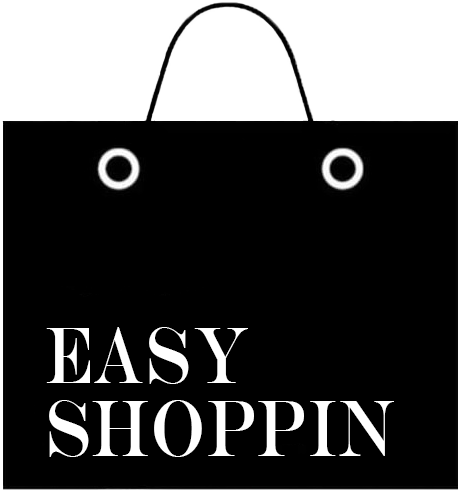

 

  

---

  
  
  
  

  Easy Shoppin — is a Flutter application of an online platform in  which you can purchase goods and services of various types

  Releases: <a href="https://github.com/dreamerenigma/easyshoppin-eshop/releases">https://github.com/dreamerenigma/easyshoppin-eshop/releases</a>

  Installation: run the apk file

## Report a problem

Write us an [issue](https://github.com/dreamerenigma/easyshoppin-eshop/issues/newe) if you find a bug or have suggestions for improving the library. If you want to ask a question or discuss the library, use the [discussions](https://github.com/dreamerenigma/easyshoppin-eshop/discussions/categories/q-a).

## Contributing

We are very happy when library users work to improve it. To leave a mark on history:

1. To get started, check out our [manifesto](https://github.com/dreamerenigma/easyshoppin-eshop/blob/main/docs/MANIFESTO.md) 📝
2. Then look at [development requirements](https://github.com/dreamerenigma/easyshoppin-eshop/main/docs/CONTRIBUTING.md) 🔧
3. Now feel free to make changes and create [pull request](https://github.com/dreamerenigma/easyshoppin-eshop/pulls) ❤️